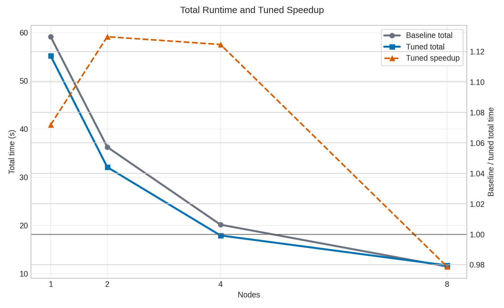
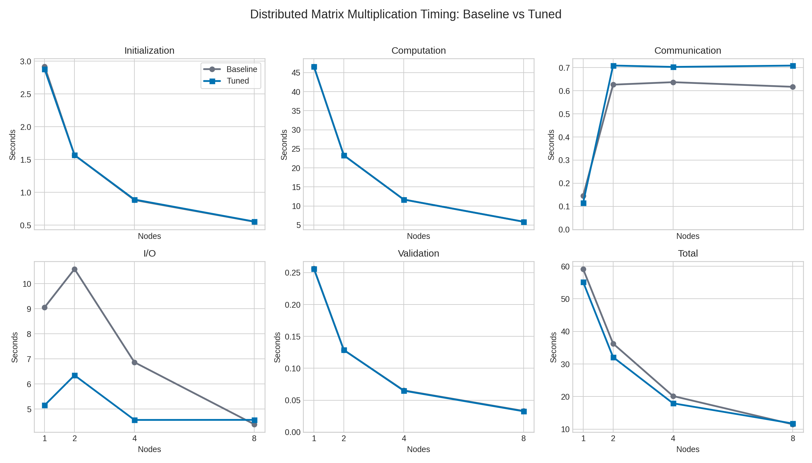

# CUDA-Aware MPI test application for Leonardo Booster nodes

This repository contains benchmarking experiments for Leonardo Booster nodes. It runs distributed matrix multiplication in Fortran using NVHPC, OpenACC/stdpar, CUDA-aware communication through HPC-X MPI, and parallel output in HDF5.

## Contents

- `dist_matmul.f90` - distributed matrix multiplication benchmark program. It initializes local matrix blocks, performs a ring exchange of `A` blocks, computes local matrix multiplication on GPUs with OpenACC, validates the local result, and writes an HDF5 file in parallel. It also prints timing for initialization, computation, communication, I/O, error validation, and total runtime.
- `job_dist_matmul.sh` - Slurm batch script for building `dist_matmul.f90` and running scaling tests on 1, 2, 4, and 8 nodes.
- `dist_matmul_stdpar.f90` - NVHPC stdpar `do concurrent` version of the benchmark. It uses separate-memory stdpar offload instead of explicit OpenACC data regions and `host_data` device pointers.
- `job_dist_matmul_stdpar.sh` - Slurm batch script for building and running the stdpar version.
- `binder.sh` - per-rank GPU and UCX device binding helper. In baseline mode it only assigns one GPU per local rank. In tuned mode it also pins each local rank to a matching UCX network device.
- `hpcx-only-env.sh` - loads the NVHPC/HPC-X module and exposes the Spack-built CUDA, NCCL, HDF5, NetCDF, and PnetCDF prefixes.
- `build-hpcx-only-env.sh` - concretizes and installs the Spack environment in `env-nvhpc-hpcx/`.
- `env-nvhpc-hpcx/spack.yaml` - Spack environment definition.
- `logs/` - Slurm stdout/stderr files.

## Software Stack

The benchmark assumes the following software stack built using Spack:

- NVHPC 25.11 (external module)
- HPC-X 2.20 (external module)
- CUDA 12.2.2 from the Spack environment (compatible with NVIDIA-SMI 535.274.02, Driver Version: 535.274.02, CUDA Version: 12.2)
- HDF5 and NetCDF-C/Fortran built with MPI from HPC-X and Fortran from NVHPC
- NCCL and CUDNN (optional)

<!--The current NetCDF-C build is MPI-enabled but not pthread-backed async:

- `netcdf-c@4.9.2 +mpi`
- `--has-parallel4 -> yes`
- `--has-parallel -> yes`
- `--has-pnetcdf -> no`
- HDF5 has `threadsafe=false`-->

## Build the Spack Environment

Replace relevant paths on `env-nvhpc-hpcx/spack.yaml` then run this command once or whenever the YAML file changes:

```bash
./build-hpcx-only-env.sh
```

This installs packages under:

```text
/leonardo_scratch/large/userexternal/$USER/spack-install/env-nvhpc-hpcx
```

When debugging, load the environment in an interactive shell:

```bash
srun --account $ACCOUNT --partition=boost_usr_prod --qos=boost_qos_dbg --nodes=1 --ntasks=4 --ntasks-per-node=32 --gres=gpu:4 --pty bash
source ./hpcx-only-env.sh
...
```

That script exports paths such as `CUDA_HOME`, `NVHPC_CUDA_HOME`, `HDF5_HOME`, `NETCDF_C_HOME`, `NETCDF_FORTRAN_HOME`, `PNETCDF_HOME`, and `HPCX_MPI_HOME`.

## Compilation

The Slurm script compiles the program before running it so you don't need to do this. In any case the command is:

```bash
"${HPCX_MPI_HOME}/bin/mpif90" -O3 -acc -gpu=cc80 -Minfo=accel \
  -I"${HDF5_HOME}/include" \
  -L"${HDF5_HOME}/lib" \
  dist_matmul.f90 -o dist_matmul.x \
  -lhdf5_fortran -lhdf5
```

For stdpar variant, the command is:

```bash
"${HPCX_MPI_HOME}/bin/mpif90" -O3 -stdpar=gpu -gpu=cc80,mem:separate -Minfo=stdpar \
  -I"${HDF5_HOME}/include" \
  -L"${HDF5_HOME}/lib" \
  dist_matmul_stdpar.f90 -o dist_matmul_stdpar.x \
  -lhdf5_fortran -lhdf5
```

This variant uses `do concurrent` for parallel initialization, matrix multiplication, and block-copy loops offloaded to GPU. It does not use `host_data use_device` directives, so MPI sees ordinary host Fortran arrays with compiler-managed device copies rather than explicit OpenACC device pointers. Treat it as a portability and programming-model comparison against the OpenACC CUDA-aware MPI version, not as a guaranteed faster replacement.

## Run the Scaling Benchmark

Submit the Slurm job:

```bash
sbatch job_dist_matmul.sh
```

To run the stdpar variant instead:

```bash
sbatch job_dist_matmul_stdpar.sh
```

The job requests 8 nodes and runs each scaling point:

```text
1 node  / 4 ranks
2 nodes / 8 ranks
4 nodes / 16 ranks
8 nodes / 32 ranks
```

Each point is run in two modes:

- `baseline` - no explicit MPI binding/mapping, no per-rank `UCX_NET_DEVICES`, no `UCX_RNDV_THRESH`, and no `numactl --localalloc`. It still keeps the CUDA-aware MPI requirements (`OMPI_MCA_pml=ucx`, `OMPI_MCA_osc=ucx`, and `UCX_TLS` with CUDA transports), because the OpenACC code passes device pointers to MPI. `binder.sh` still assigns `CUDA_VISIBLE_DEVICES` by local rank so ranks use separate GPUs.
- `tuned` - uses `--bind-to core --map-by ppr:4:node:PE=8`, environment UCX/Open MPI settings mentioned above, and  `UCX_NET_DEVICES` and GPU binding per local rank from `binder.sh`.

Set `REPORT_BINDINGS=1` to include Open MPI binding reports:

```bash
REPORT_BINDINGS=1 sbatch job_dist_matmul.sh
```

Set `UCX_LOG_LEVEL` if UCX logs are needed:

```bash
UCX_LOG_LEVEL=info sbatch job_dist_matmul.sh
```

## Outputs

Slurm output and error files are written to:

```text
logs/slurm-matmul-<jobid>.out
logs/slurm-matmul-<jobid>.err
```

Each run writes a separate HDF5 output file:

```text
C_dist_baseline_1nodes_4ranks.h5
C_dist_tuned_1nodes_4ranks.h5
C_dist_baseline_2nodes_8ranks.h5
C_dist_tuned_2nodes_8ranks.h5
C_dist_baseline_4nodes_16ranks.h5
C_dist_tuned_4nodes_16ranks.h5
C_dist_baseline_8nodes_32ranks.h5
C_dist_tuned_8nodes_32ranks.h5
```

The stdpar script writes similarly named files with a `C_dist_stdpar_` prefix:

```text
C_dist_stdpar_baseline_1nodes_4ranks.h5
C_dist_stdpar_tuned_1nodes_4ranks.h5
...
C_dist_stdpar_baseline_8nodes_32ranks.h5
C_dist_stdpar_tuned_8nodes_32ranks.h5
```

The timing line has this format:

```text
TIMING ranks=<n> init_s=<s> computation_s=<s> communication_s=<s> io_s=<s> validation_s=<s> total_s=<s>
```

Timings are obtained using `MPI_MAX` reduction across ranks, so each value comes from the slowest rank for that component. Communication time includes MPI post time and MPI wait time. Because communication is overlapped with GPU computation, the reported communication component is the exposed communication cost, not a fully non-overlapped transfer time.

## Results

Plots and parsed CSV files are available under `plots/`:

- `plots/timing_components_baseline_vs_tuned.png` - runtime comparison for initialization, computation, communication, I/O, validation, and total time.
- `plots/timing_total_baseline_vs_tuned.png` - total runtime plus  speedup after tuning.
- `plots/timing_baseline_vs_tuned.csv` - data on component timings.
- `plots/timing_total_summary.csv` - data on total runtime and speedup.

Total runtime from this run:



| Nodes | Ranks | Baseline total (s) | Tuned total (s) | Baseline / tuned |
| ---: | ---: | ---: | ---: | ---: |
| 1 | 4 | 59.154 | 55.188 | 1.07x |
| 2 | 8 | 36.268 | 32.103 | 1.13x |
| 4 | 16 | 20.166 | 17.932 | 1.12x |
| 8 | 32 | 11.478 | 11.727 | 0.98x |

In the analyzed run, the tuned configuration improves total time on 1, 2, and 4 nodes, with the strongest gain around 2-4 nodes.



 The dominant improvement is I/O time: tuned I/O drops from 9.06 s to 5.15 s on 1 node, from 10.59 s to 6.35 s on 2 nodes, and from 6.87 s to 4.57 s on 4 nodes. Computation time is essentially unchanged between baseline and tuned runs because both modes execute the same GPU kernels with the same rank count and problem decomposition.

At 8 nodes, tuned total time is slightly worse in this sample. The main reason is that tuned I/O is not better at this scale in the latest run (4.57 s tuned vs 4.39 s baseline), while exposed communication is also higher (0.709 s tuned vs 0.617 s baseline). This difference is small compared with the full runtime and should be interpreted as one-run variability unless repeated measurements show the same trend.

The communication component is not a pure network bandwidth measurement. The code calls nonblocking MPI receive and send, launches the OpenACC kernel, waits for the GPU computation, and then waits for nonblocking MPI calls to finish. Therefore `communication_s` mostly measures nonblocking MPI call plus wait time after computation overlap. A tuned run can show slightly higher communication time while still being faster overall if computation finishes earlier. For a clean communication-only comparison, you add a separate benchmark that times the ring exchange without the matrix kernel and HDF5 write, or disable overlap by waiting for MPI before launching computation.

Relative errors are around `1e-14` to `1e-13`, which is consistent with double-precision roundoff for results with magnitude near `1e18`. The nonzero absolute errors are expected at this scale and should be judged using `max_rel_error`, not only `max_abs_error`.

## Notes

- The benchmark currently uses `N = 65536` in `dist_matmul.f90` with error validation disabled. Memory use is high and the Slurm scripts request exclusive GPU nodes.
- `N` must be divisible by the MPI world size.
- The OpenACC benchmark uses `host_data use_device` around MPI calls, so CUDA-aware MPI support is required for explicit device-buffer communication.
- The stdpar benchmark uses NVHPC separate-memory behavior so MPI/HDF5 operate on host arrays while stdpar kernels use compiler-managed device copies. If it runs slower or shows different communication behavior, that is expected and should be interpreted as a programming-model comparison.
- If the NVHPC compiler reports a missing CUDA toolkit, check that `hpcx-only-env.sh` exports `NVHPC_CUDA_HOME` and `NVCOMPILER_CUDA_HOME` to the Spack CUDA 12.2.2 prefix.
- The batch scripts set `OMPI_MCA_fcoll=^vulcan` to avoid an Open MPI OMPIO `vulcan` file-collective crash observed during parallel HDF5 writes.

## References
- [NVIDIA HPC SDK 25.11 release notes](https://docs.nvidia.com/hpc-sdk/archive/25.11/pdf/hpc-sdk2511rn.pdf)
- [Spack environments](https://spack.readthedocs.io/en/latest/environments.html)
- [Programming for NVIDIA GPUs](https://www.nas.nasa.gov/hecc/support/kb/programming-for-nvidia-gpus_647.html)

## Diagnostics

```
nvidia-smi

Tue Jun  2 18:46:44 2026       
+---------------------------------------------------------------------------------------+
| NVIDIA-SMI 535.274.02             Driver Version: 535.274.02   CUDA Version: 12.2     |
|-----------------------------------------+----------------------+----------------------+
| GPU  Name                 Persistence-M | Bus-Id        Disp.A | Volatile Uncorr. ECC |
| Fan  Temp   Perf          Pwr:Usage/Cap |         Memory-Usage | GPU-Util  Compute M. |
|                                         |                      |               MIG M. |
|=========================================+======================+======================|
|   0  NVIDIA A100-SXM-64GB           On  | 00000000:1D:00.0 Off |                    0 |
| N/A   44C    P0              76W / 467W |  33254MiB / 65536MiB |      0%      Default |
|                                         |                      |             Disabled |
+-----------------------------------------+----------------------+----------------------+
|   1  NVIDIA A100-SXM-64GB           On  | 00000000:56:00.0 Off |                    0 |
| N/A   44C    P0              74W / 465W |  33254MiB / 65536MiB |      0%      Default |
|                                         |                      |             Disabled |
+-----------------------------------------+----------------------+----------------------+
|   2  NVIDIA A100-SXM-64GB           On  | 00000000:8F:00.0 Off |                    0 |
| N/A   43C    P0              72W / 448W |  33254MiB / 65536MiB |      0%      Default |
|                                         |                      |             Disabled |
+-----------------------------------------+----------------------+----------------------+
|   3  NVIDIA A100-SXM-64GB           On  | 00000000:C8:00.0 Off |                    0 |
| N/A   43C    P0              76W / 458W |  33254MiB / 65536MiB |      0%      Default |
|                                         |                      |             Disabled |
+-----------------------------------------+----------------------+----------------------+
                                                                                         
+---------------------------------------------------------------------------------------+
| Processes:                                                                            |
|  GPU   GI   CI        PID   Type   Process name                            GPU Memory |
|        ID   ID                                                             Usage      |
|=======================================================================================|
|    0   N/A  N/A    255872      C   ...pcx-cuda-booster-test/dist_matmul.x    33246MiB |
|    1   N/A  N/A    255873      C   ...pcx-cuda-booster-test/dist_matmul.x    33246MiB |
|    2   N/A  N/A    255874      C   ...pcx-cuda-booster-test/dist_matmul.x    33246MiB |
|    3   N/A  N/A    255875      C   ...pcx-cuda-booster-test/dist_matmul.x    33246MiB |
+---------------------------------------------------------------------------------------+

nvidia-smi topo -m

        GPU0    GPU1    GPU2    GPU3    NIC0    NIC1    NIC2    NIC3    CPU Affinity    NUMA Affinity   GPU NUMA ID
GPU0     X      NV4     NV4     NV4     PXB     NODE    NODE    NODE    0-15    0               N/A
GPU1    NV4      X      NV4     NV4     NODE    PXB     NODE    NODE    0-15    0               N/A
GPU2    NV4     NV4      X      NV4     NODE    NODE    PXB     NODE    0-15    0               N/A
GPU3    NV4     NV4     NV4      X      NODE    NODE    NODE    PXB     0-15    0               N/A
NIC0    PXB     NODE    NODE    NODE     X      NODE    NODE    NODE
NIC1    NODE    PXB     NODE    NODE    NODE     X      NODE    NODE
NIC2    NODE    NODE    PXB     NODE    NODE    NODE     X      NODE
NIC3    NODE    NODE    NODE    PXB     NODE    NODE    NODE     X 

Legend:

  X    = Self
  SYS  = Connection traversing PCIe as well as the SMP interconnect between NUMA nodes (e.g., QPI/UPI)
  NODE = Connection traversing PCIe as well as the interconnect between PCIe Host Bridges within a NUMA node
  PHB  = Connection traversing PCIe as well as a PCIe Host Bridge (typically the CPU)
  PXB  = Connection traversing multiple PCIe bridges (without traversing the PCIe Host Bridge)
  PIX  = Connection traversing at most a single PCIe bridge
  NV#  = Connection traversing a bonded set of # NVLinks

NIC Legend:

  NIC0: mlx5_0
  NIC1: mlx5_1
  NIC2: mlx5_2
  NIC3: mlx5_3

```